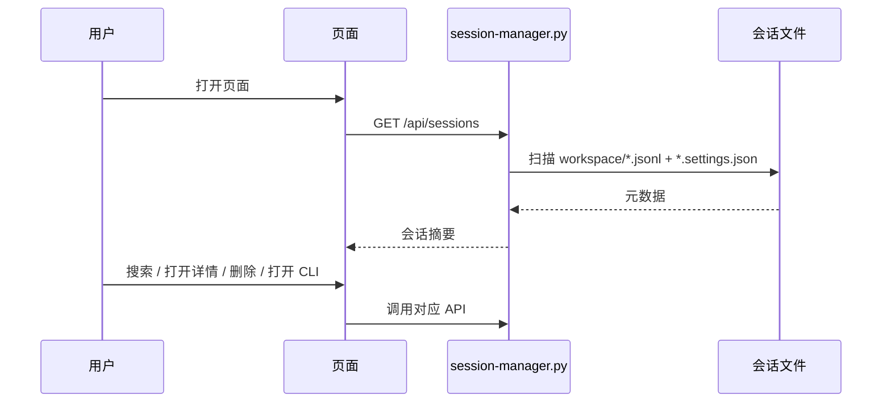

# 网页端

Active contributors: unavailable in this checkout（当前目录缺少 `.git` 元数据）。

网页端是这个项目的主运行形态：`session-manager.py` 启动本地 HTTP 服务，`frontend/index.html` 和 `frontend/assets/app.js` 渲染界面。它没有单独前端构建步骤，也没有反向代理或数据库，一切都围绕本地文件系统和本地浏览器展开。

## Purpose

网页端负责给用户一个可搜索、可筛选、可分析的会话管理界面，同时把副作用动作（删除、打开 CLI）包装成按钮操作。它是用户看到的大部分功能集合。

## Directory layout

```text
frontend/
├── index.html
└── assets/
    ├── app.js
    └── style.css
session-manager.py
```

## Key abstractions

| File | Purpose |
|---|---|
| `frontend/index.html` | 页面骨架、顶部工具栏、列表区、分析区、模态框 |
| `frontend/assets/app.js` | 状态管理、请求 API、渲染卡片、绘制图表、处理删除与 CLI 动作 |
| `frontend/assets/style.css` | 深浅色主题与图表样式 |
| `session-manager.py` | 提供网页端依赖的本地 API 和静态资源服务 |

## How it works

1. 浏览器打开 `http://127.0.0.1:<port>`
2. 后端返回 `frontend/index.html`
3. `app.js` 请求 `/api/sessions`
4. 页面渲染列表、统计卡片和分析图表
5. 用户再触发详情、搜索、删除、CLI 打开等动作



## Integration points

- 依赖 [后端 API](../systems/backend-api.md) 提供所有数据
- 依赖 [会话发现](../systems/session-discovery.md) 提供原始会话摘要
- 依赖 [清理与 CLI 动作](../features/cleanup-and-cli-actions.md) 所对应的副作用接口

## Entry points for modification

如果你要改用户能看到的内容，先从 `frontend/assets/app.js` 下手；如果只是布局或色彩，改 `frontend/assets/style.css`。只有在需要新增接口或改响应结构时，才需要同步修改 `session-manager.py`。
