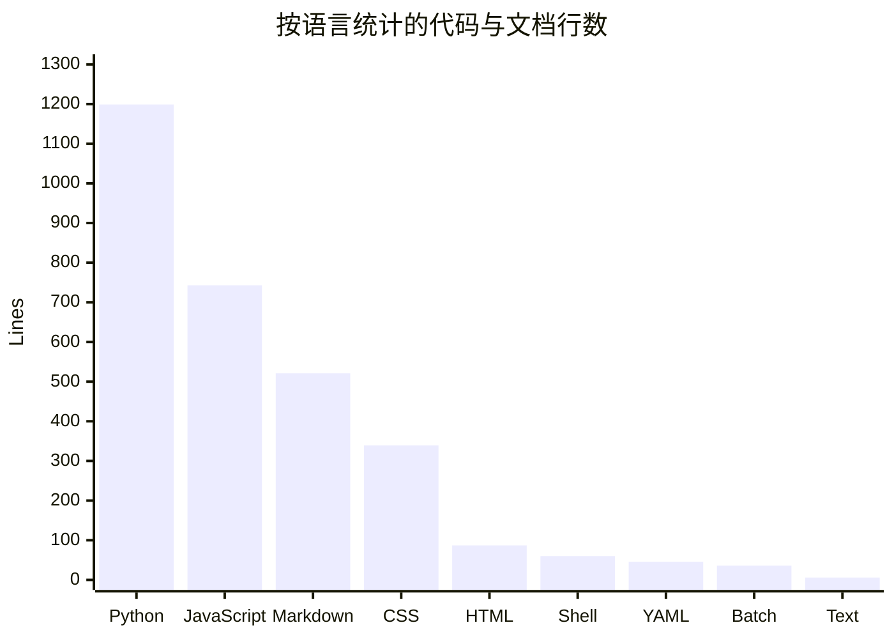

# 代码库数字速览

Data collected on 2026-04-05。本页只描述当前 checkout 能直接观察到的数字。当前目录缺少 `.git/` 元数据，因此 commit 趋势、活跃目录 churn、bot 提交比例等历史指标不可用。

## 规模

当前仓库可读文本文件的语言分布如下：

| Metric | Value |
|---|---:|
| 源码文件 | 13 |
| 测试文件 | 0 |
| 配置 / 文档文件 | 6 |
| Python 行数 | 1199 |
| JavaScript 行数 | 743 |
| 总可读文本行数 | 3037 |

## 目录体量

| Directory | Files | Lines | Notes |
|---|---:|---:|---|
| `<root>` | 13 | 1470 | 后端、桌面入口、打包脚本、README 与项目技能 |
| `frontend/` | 3 | 1169 | 前端页面、样式和所有 UI 交互 |
| `.factory/` | 2 | 352 | 项目内打包 skill |
| `.github/` | 1 | 46 | 桌面构建工作流 |

`frontend/` 与根目录的 Python 脚本几乎各占一半体量，这也是仓库最清晰的系统边界。

## 复杂度热点

| File | Lines | Why it matters |
|---|---:|---|
| `session-manager.py` | 752 | 同时负责目录发现、API、CLI 启动、删除操作 |
| `frontend/assets/app.js` | 743 | 承担 i18n、主题、列表、详情、分析图表与清理动作 |
| `frontend/assets/style.css` | 339 | 所有视觉样式集中在一个文件 |
| `README.md` | 210 | 运行、打包、构建流程说明 |
| `build-desktop.py` | 176 | 打包、自检、归档逻辑 |

这两个最大文件支撑了整个产品功能，所以如果后续继续加特性，它们最容易继续膨胀。详细建议见 [清理机会](cleanup-opportunities.md)。

## 测试与自动化

| Metric | Value | Interpretation |
|---|---:|---|
| 专门测试文件 | 0 | 仓库没有单元测试或集成测试目录 |
| 自检入口 | 1 | `session-manager-desktop.py --self-test` 是当前最接近自动测试的机制 |
| GitHub Actions 工作流 | 1 | `.github/workflows/build-desktop.yml` 负责三平台桌面构建 |

## 历史指标不可用项

下列指标原本适合放在本页，但当前 checkout 无法可靠计算：

- commits per week / month
- 90 天 churn hotspot
- bot-attributed commit 占比
- bus factor / 最近活跃贡献者

如果后续在一个完整 git checkout 中重新生成 wiki，本页应补上这些维度，并与 [lore](lore.md) 交叉引用。
