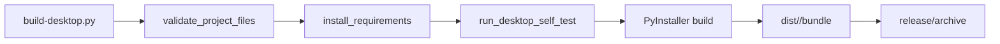

# 部署与打包

这个项目没有传统意义上的服务端部署流程；它更像一个本地工具的分发流程。部署的重点在桌面打包和归档，而不是服务器上线。

## 本地运行形态

- Web：`python3 session-manager.py`
- Desktop：`python3 session-manager-desktop.py`

这两种形态都依赖本地文件系统和本机终端，不需要远程基础设施。

## 打包链路

`build-desktop.py` 是统一打包入口，流程如下：

## 平台包装脚本

- `build-local-macos.sh`
- `build-local-linux.sh`
- `build-local-windows.bat`

这些脚本都只是薄包装，最终都会转发到 `build-desktop.py`。这保证了本地构建和 CI 构建走同一条逻辑路径。

## 产物

README 记录的默认产物：

- macOS：`.app` + `.zip`
- Windows：`.exe` + `.zip`
- Linux：可执行文件 + `.tar.gz`

## CI

`.github/workflows/build-desktop.yml` 会在：

- `windows-latest`
- `macos-latest`
- `ubuntu-latest`

上分别执行安装依赖、自检和打包，然后上传 `release/*`。

## 交付建议

如果只是给别人源码或运行包，不一定要重新发明压缩逻辑。仓库里已经包含项目级 `project-packager` skill，可用来生成标准化 ZIP。相关背景见 [工具链](how-to-contribute/tooling.md)。
