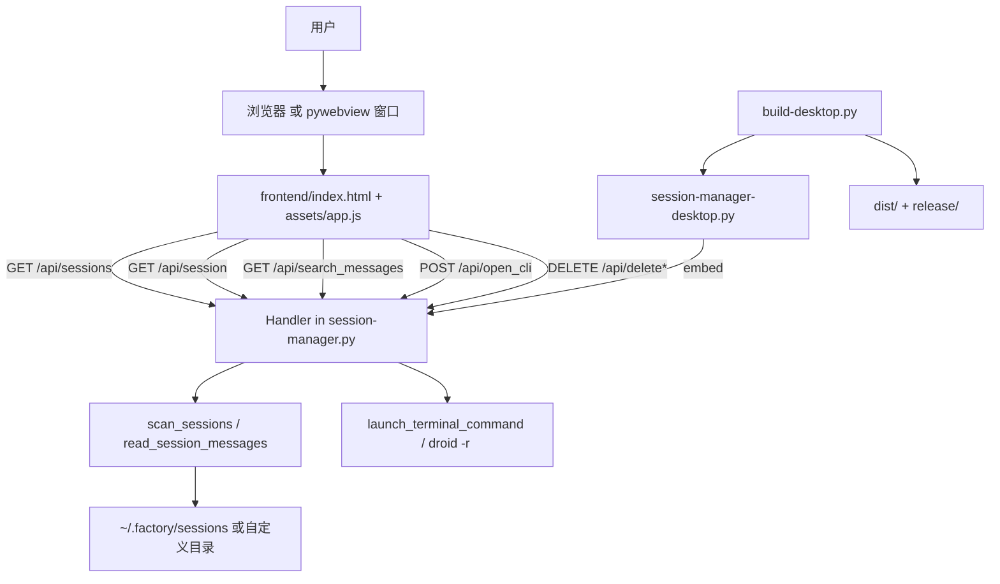
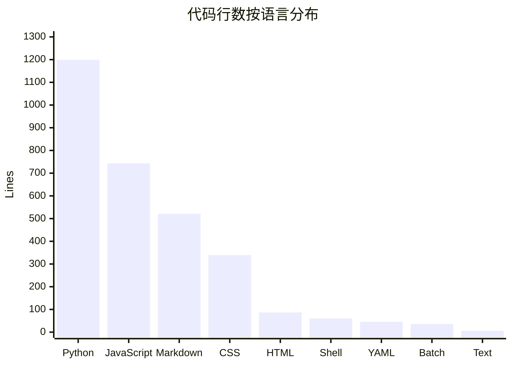
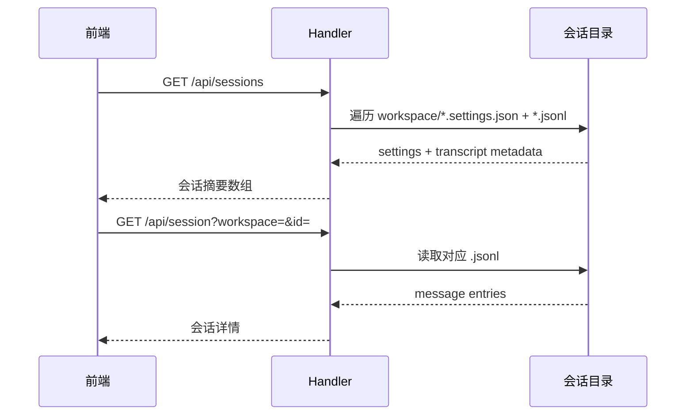

# 系统架构

项目的架构非常直接：一个本地 Python HTTP 服务读取 `sessions` 目录，前端通过 HTTP API 读取数据；桌面端把同一服务放进本地窗口。没有数据库、消息队列、远程 API 或单独的前端构建步骤。

这意味着项目的大部分复杂度不在基础设施，而在三个地方：会话目录发现、`.jsonl`/`.settings.json` 解析，以及前端对这些数据的聚合和可视化。想看具体实现时，可以分别跳到 [会话发现](../systems/session-discovery.md)、[后端 API](../systems/backend-api.md) 和 [分析功能](../features/analytics.md)。

## 架构图

## 主要组件

### 1. 本地服务层

`session-manager.py` 用 `http.server` + `BaseHTTPRequestHandler` 搭了一个本地服务，默认绑定到 `127.0.0.1:18901`。它承担四类职责：

- 发现会话目录并扫描工作区
- 解析 `.jsonl` 与 `.settings.json`
- 对外提供 `/api/*` 接口
- 处理删除和 CLI 打开这样的副作用操作

### 2. 前端展示层

`frontend/index.html` 只提供页面骨架，绝大部分逻辑在 `frontend/assets/app.js`。这个文件负责：

- 国际化（中英切换）
- 深色 / 浅色主题切换
- 自动刷新与刷新间隔持久化
- 会话列表渲染与详情弹窗
- 统计图表与工作区排行

### 3. 桌面封装层

`session-manager-desktop.py` 会动态加载 `session-manager.py`，再启动一个随机端口的嵌入式服务，并把 URL 交给 `pywebview`。桌面版没有自己的业务 API，也没有独立数据模型；它只是复用了网页端后端。

### 4. 构建与发布层

`build-desktop.py` 会验证必需文件、安装依赖、执行 `--self-test`、运行 `PyInstaller`，最后把产物打成平台归档。GitHub Actions 工作流 `.github/workflows/build-desktop.yml` 复用的也是同一入口。

## 语言与体量

Python 和 JavaScript 几乎占了全部实现体量：前者负责后端、桌面启动和打包，后者负责 UI 与分析。这个分布也解释了为什么 [复杂度热点](../cleanup-opportunities.md) 主要集中在 `session-manager.py` 与 `frontend/assets/app.js`。

## 数据流

典型请求流程如下：

对删除与 CLI 打开这样的动作，流向会从只读转成带副作用的本地操作，详见 [安全](../security.md) 和 [清理与 CLI 动作](../features/cleanup-and-cli-actions.md)。

## 入口点

- Web 模式：直接运行 `session-manager.py`
- Desktop 模式：运行 `session-manager-desktop.py`
- Build 模式：运行 `build-desktop.py` 或平台包装脚本

如果你要改业务逻辑，通常从 [后端 API](../systems/backend-api.md) 和 [会话发现](../systems/session-discovery.md) 开始；如果你要改交互体验，从 [网页端](../apps/web.md) 开始。
