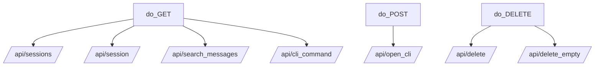

# 后端 API

Active contributors: unavailable in this checkout（当前目录缺少 `.git` 元数据）。

`session-manager.py` 里的 `Handler` 是整个产品的 API 层。它不做复杂抽象，而是把一组很具体的本地操作映射成 `/api/*` 路由：列会话、查详情、搜消息、生成 CLI 命令、删除会话、清理空会话。

## Purpose

这个系统负责把文件系统里的会话数据转换成前端能消费的 JSON，同时把本地副作用操作收口到统一入口。

## Directory layout

```text
session-manager.py
├── Handler(BaseHTTPRequestHandler)
├── create_server()
├── scan_sessions()
├── read_session_messages()
├── search_sessions_by_message()
├── launch_cli_for_session()
└── delete_session()
```

## Key abstractions

| File | Purpose |
|---|---|
| `session-manager.py` | 定义 HTTP handler、路由、响应和副作用入口 |
| `frontend/index.html` | 消费这些 API 的页面骨架 |
| `frontend/assets/app.js` | 用 `fetch()` 驱动 API 请求和页面更新 |

## How it works

`Handler.do_GET()` 处理只读接口，`do_POST()` 只处理 `/api/open_cli`，`do_DELETE()` 负责删除相关接口。所有 JSON 响应最后都通过 `_json_response()` 序列化。



## Integration points

- 调用 `scan_sessions()` 和 `read_session_messages()` 获取数据
- 调用 `launch_cli_for_session()` 与本机终端交互
- 调用 `delete_session()` 删除本地文件
- 通过 `_send_frontend_file()` 直接提供静态资源

## Entry points for modification

新增接口时先看 `Handler.do_GET()` / `do_POST()` / `do_DELETE()`，再决定是否需要新增独立 helper 函数。若只是调整响应字段，通常也要同步修改 `frontend/assets/app.js` 的消费逻辑。

更多路由细节见 [API 端点](../api/endpoints.md)。
