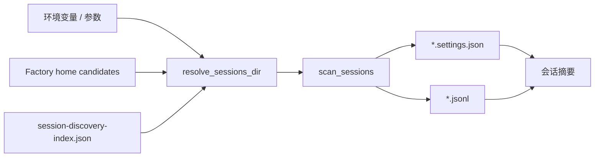

# 会话发现

Active contributors: unavailable in this checkout（当前目录缺少 `.git` 元数据）。

会话发现系统决定了工具“能看到什么”。它会从环境变量、Factory 主目录和索引文件里推断 sessions 目录，再扫描每个 workspace 下的 `.settings.json` 和 `.jsonl` 文件，把它们整理成前端使用的会话摘要。

## Purpose

这个系统负责定位本地会话目录、去重、归一化 workspace 名称，并抽取标题、模型、token、消息数量、活跃时间等摘要字段。

## Directory layout

```text
session-manager.py
├── resolve_sessions_dir()
├── factory_home_candidates()
├── sessions_dir_from_index()
├── scan_sessions()
├── read_session_messages()
└── search_sessions_by_message()
```

## Key abstractions

| File | Purpose |
|---|---|
| `session-manager.py` | 目录发现、会话摘要构建、消息解析 |
| `README.md` | 记录 `--sessions-dir` 和相关环境变量 |
| `项目介绍.md` | 用自然语言总结会话目录覆盖逻辑 |

## How it works

`resolve_sessions_dir()` 的优先级大致是：显式参数 → sessions 环境变量 → Factory 主目录环境变量 → `session-discovery-index.json` → `~/.factory/sessions`。拿到目录后，`scan_sessions()` 会：

1. 枚举 workspace 目录
2. 匹配 `<sid>.settings.json` 与 `<sid>.jsonl`
3. 用真实路径做去重，避免符号链接重复会话
4. 从 settings 里拿 token、model、active time
5. 从 transcript 首行拿 title、cwd
6. 统计消息数量与最后修改时间



## Integration points

- 被 [后端 API](backend-api.md) 用于 `/api/sessions`
- 被 [会话浏览功能](../features/session-browsing.md) 与 [分析功能](../features/analytics.md) 间接消费
- 被删除逻辑重用，以便按 workspace + id 找到真实文件

## Entry points for modification

如果你要支持新的 sessions 目录发现方式，先改 `resolve_sessions_dir()` 和相关候选函数。若你要扩展会话摘要字段，重点改 `scan_sessions()`，同时记得检查 [数据模型](../reference/data-models.md) 与前端渲染逻辑。
